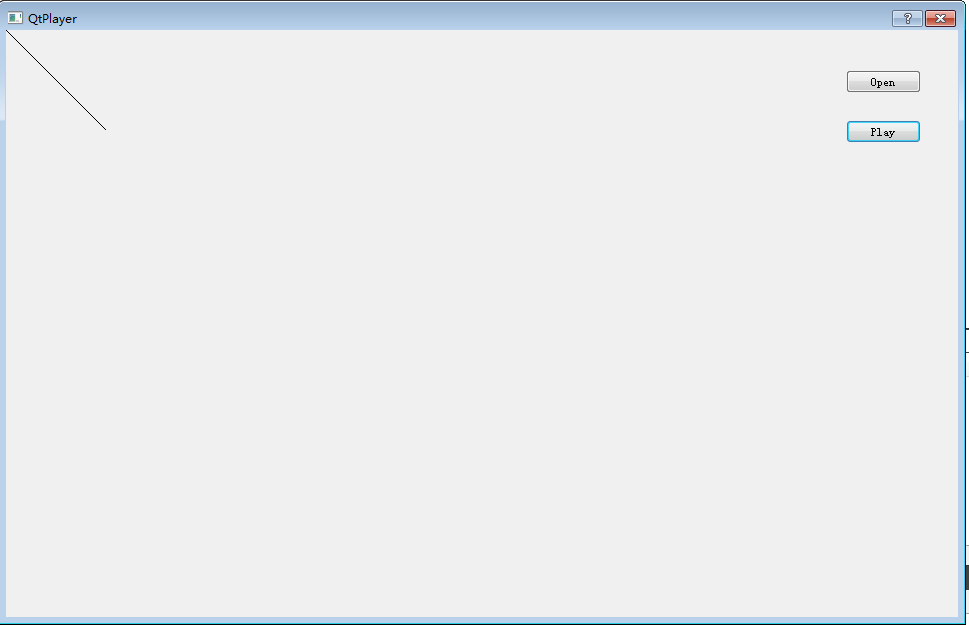

## Player Base

1、使用QT创建一个基于对话框的应用程序，带有两个Button：Open，Play
2、运行，可以生成一个应用程序，对话框的。
3、添加新文件->Qt设计师界面类->起名字PlayerRenderer

我们在dialog.ui中添加一个horizontalLayout，然后把PlayerRenderer加到这里面来：

4、在Dialog::Dialog(QWidget *parent)添加以下几句

```
player_renderer_ = new PlayerRenderer(this);
ui->horizontalLayout->addWidget(player_renderer_);
player_renderer_->hide();

connect(ui->pushButtonOpen,SIGNAL(clicked()),this,SLOT(slotButtonClick()));
connect(ui->pushButtonPlay,SIGNAL(clicked()),this,SLOT(slotButtonClick()));
```
slotButtonClick实现如下
```
void Dialog::slotButtonClick() {
    if (QObject::sender() == ui->pushButtonOpen)
    {
        qDebug()<<"pushButtonOpen";
    }
    else if (QObject::sender() == ui->pushButtonPlay)
    {
        qDebug()<<"pushButtonPlay";

        player_renderer_->show();

        player_renderer_->update();
    }
}
```

PlayerRenderer::paintEvent重写如下
```
void PlayerRenderer::paintEvent(QPaintEvent *event) {
    qDebug()<<"paintEvent";

    QPainter painter(this);

    painter.drawLine(QPoint(0,0),QPoint(100,100));

}
```

这样点击Play按钮就会有如下的效果



以后PlayerRenderer只负责显示视频
